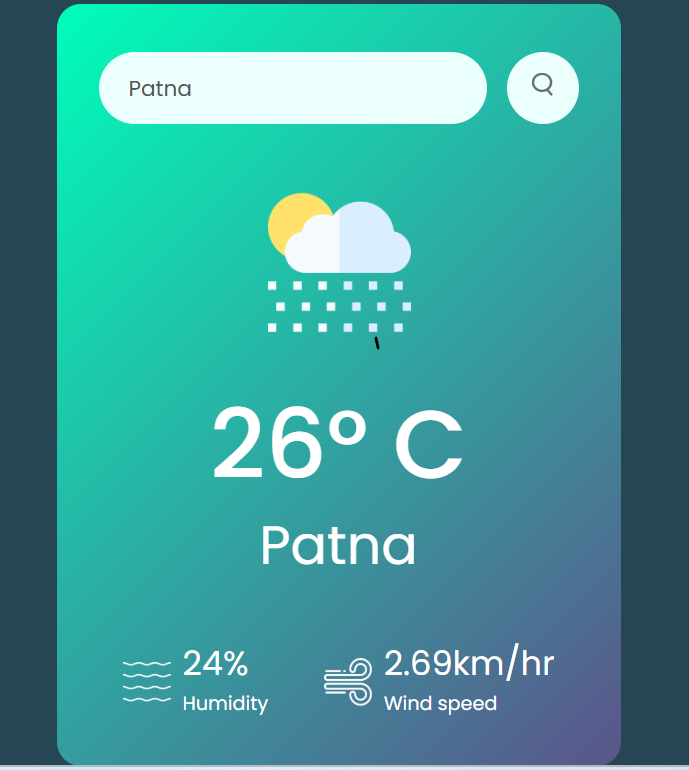

# 🌦 Weather App

A simple and responsive Weather App that allows users to search for any city and get real-time weather information.

---

## 🚀 Live Demo
🔗https://abhiyadav012.github.io/weather-app/

---

## 🚀 Features

- 🔍 Search weather by city name
- 🌡 Shows temperature
- ☁ Displays weather condition
- 📱 Simple and responsive UI

---

## 🛠 Tech Stack

- HTML
- CSS
- JavaScript
- Weather API

---

## 📷 Screenshot

---

## ⚙️ How to Run

1. Clone the repository
2. Open the project folder
3. Run `index.html` in your browser

---

## 👨‍💻 Author

**Abhishek Kumar**

- GitHub: https://github.com/Abhiyadav012